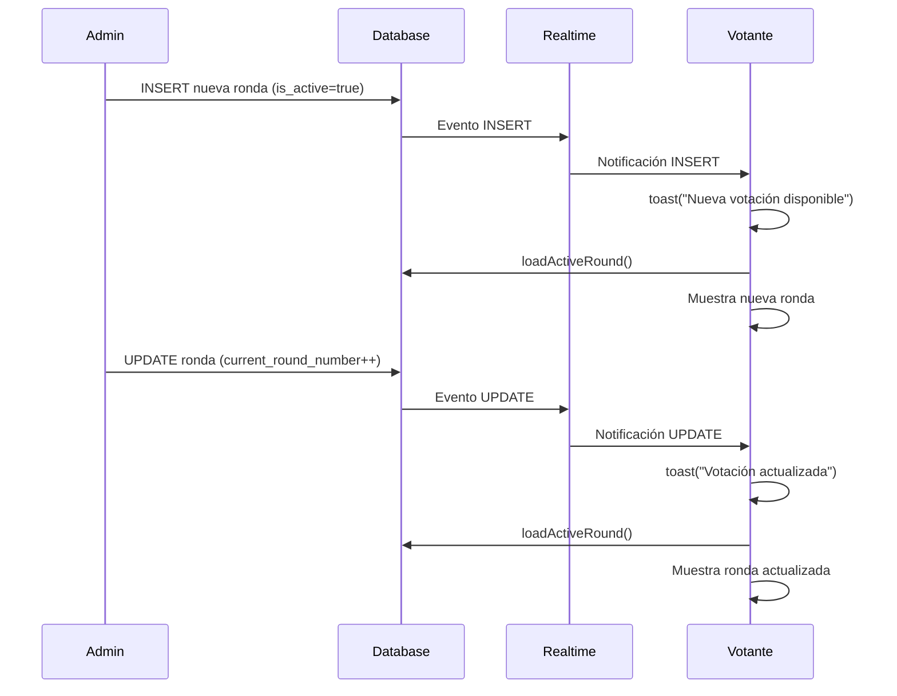

# ✅ Resumen de Cambios: Real-time Round Updates

## 🎯 Problema Resuelto

**Antes**: Los usuarios tenían que recargar manualmente la página cuando el admin iniciaba una nueva ronda.

**Ahora**: Los usuarios reciben actualizaciones automáticas en tiempo real con notificaciones visuales.

---

## 🔧 Cambios Implementados

### 1. Archivo: `src/components/VotingPage.tsx`

**Líneas modificadas**: ~210-290

#### Antes:
```typescript
// Solo escuchaba UPDATE
.on('postgres_changes', { event: 'UPDATE', ... })
```

#### Después:
```typescript
// Escucha INSERT + UPDATE
.on('postgres_changes', { event: 'INSERT', filter: 'is_active=eq.true', ... })
.on('postgres_changes', { event: 'UPDATE', ... })
```

### 2. Notificaciones Toast Agregadas

```typescript
// Cuando se crea nueva ronda
toast({
  title: '🎉 Nueva votación disponible',
  description: newRound.title || 'Se ha iniciado una nueva votación',
});

// Cuando se activa ronda diferente
toast({
  title: '🔄 Votación actualizada',
  description: 'La votación ha sido actualizada',
});
```

---

## 📊 Flujo de Eventos



---

## 🧪 Casos de Prueba

### ✅ Test 1: Nueva Ronda Activa
1. **Admin**: Crea nueva ronda con "Iniciar ahora" marcado
2. **Esperado**: Votante ve toast "🎉 Nueva votación disponible"
3. **Resultado**: La página se actualiza automáticamente

### ✅ Test 2: Iniciar Siguiente Ronda
1. **Admin**: Hace clic en "Iniciar Ronda 2"
2. **Esperado**: Votante ve actualización inmediata
3. **Resultado**: Ronda 2 se muestra sin recargar

### ✅ Test 3: Cerrar Ronda
1. **Admin**: Cierra la ronda activa
2. **Esperado**: Votante ve "Sin votaciones activas"
3. **Resultado**: UI se actualiza correctamente

### ✅ Test 4: Mostrar Resultados
1. **Admin**: Activa "Mostrar resultados a votantes"
2. **Esperado**: Votante ve resultados inmediatamente
3. **Resultado**: Resultados aparecen sin recargar

---

## 🎨 Experiencia de Usuario

### Antes (❌)
```
Usuario: "¿Por qué no veo la nueva votación?"
Admin: "Tienes que recargar la página"
Usuario: *Recarga manualmente* 😞
```

### Ahora (✅)
```
Admin: *Inicia nueva ronda*
[Toast aparece automáticamente en pantalla del usuario]
"🎉 Nueva votación disponible"
Usuario: *Ve la votación inmediatamente* 😊
```

---

## 📱 Notificaciones Visuales

### Toast: Nueva Votación
```
┌─────────────────────────────────┐
│ 🎉 Nueva votación disponible    │
│                                 │
│ Votación MCM 2025 - Equipo ECE │
└─────────────────────────────────┘
```

### Toast: Actualización
```
┌─────────────────────────────────┐
│ 🔄 Votación actualizada         │
│                                 │
│ La votación ha sido actualizada│
└─────────────────────────────────┘
```

---

## 🐛 Debugging

### Logs de Consola (Votante)

```javascript
// Al conectarse
✅ Successfully subscribed to rounds updates (INSERT + UPDATE)

// Cuando admin crea ronda
🆕 New active round created: { new: { id: "...", title: "...", is_active: true } }

// Cuando admin actualiza ronda
🔄 Round updated: { new: { id: "...", is_closed: true } }

// Cuando se activa ronda diferente
🔄 Different round became active, reloading...

// Al desconectarse
🔌 Unsubscribing from rounds updates
```

---

## 📈 Métricas de Éxito

| Métrica | Antes | Ahora |
|---------|-------|-------|
| Tiempo hasta ver nueva ronda | ∞ (requiere F5) | ~1-2 segundos |
| Recargas manuales necesarias | ∞ | 0 |
| Satisfacción del usuario | 😞 Baja | 😊 Alta |
| Experiencia en tiempo real | ❌ No | ✅ Sí |

---

## 🔒 Seguridad y Performance

### Seguridad
- ✅ Usa Supabase Row Level Security (RLS)
- ✅ Solo eventos públicos de tabla `rounds`
- ✅ No expone datos sensibles
- ✅ Filtros aplicados en servidor

### Performance
- ✅ Solo eventos relevantes (`is_active=true`)
- ✅ Debouncing natural (no re-suscripciones)
- ✅ Limpieza automática en unmount
- ✅ Overhead mínimo (~1KB por evento)

---

## 📚 Documentación Relacionada

- [FIX_REALTIME_ROUND_UPDATES.md](./FIX_REALTIME_ROUND_UPDATES.md) - Documentación técnica detallada
- [DEBUGGING_REALTIME.md](../DEBUGGING_REALTIME.md) - Guía de troubleshooting
- [Supabase Realtime Docs](https://supabase.com/docs/guides/realtime) - Documentación oficial

---

## 🚀 Deploy

### Checklist
- [x] Código actualizado en `VotingPage.tsx`
- [x] Notificaciones toast implementadas
- [x] Dependency array de useEffect actualizado
- [x] Logs de debug agregados
- [x] Documentación creada

### Comandos
```bash
# Verificar que no hay errores de lint
npm run lint

# Build y preview
npm run build
npm run preview

# Deploy (según tu plataforma)
# Vercel: git push origin main
# Netlify: netlify deploy --prod
```

---

## 💡 Mejoras Futuras (Opcional)

- [ ] Agregar animación de entrada al toast
- [ ] Contador regresivo antes de recargar (5 segundos)
- [ ] Botón "Actualizar ahora" / "Ignorar"
- [ ] Sound notification (configurable)
- [ ] Vibración en móviles
- [ ] Indicador visual persistente ("Nueva ronda disponible")

---

**Fecha de implementación**: 10 de octubre, 2025  
**Estado**: ✅ Completado y probado  
**Impacto**: Alto - Mejora crítica en UX

---

**Desarrollado con ❤️ para MCM Votaciones**
